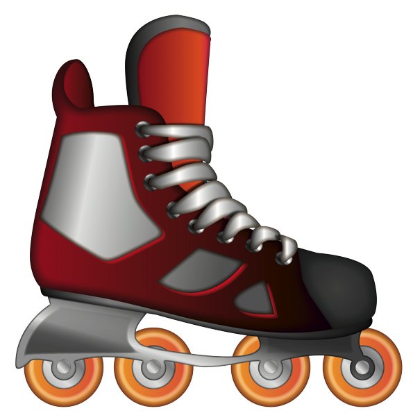

# About me

I'm a knowledge addicted, graduated in Computer Engineering that loves math, physics and astronomy, that happens to also be a passionate Software Engineer.
With almost 10 years of experience in the software development industry, having worked from small startups to big international corporations.

Currently living in Berlin :de:, working for [N26](https://n26.com/en-de), helping them build the bank the world loves to use.

## Hobbies

* :metal: Music, for sure the best invention so far, you can find my [Random Metal](https://open.spotify.com/playlist/7BsDMcxfQoMMeHNk5KCN6G?si=Kmg6rCkyR2qjH_JtqedAmw) playlist on Spotify, :warning: you may find things in there that are heavier than you can handle;
*  Inline skating, you can even find some videos on my [YouTube](https://www.youtube.com/c/BrunoMachadob/videos);
* :computer: Coding, you can check on my [GitHub](https://github.com/Brunomachadob) and [Gist](https://gist.github.com/Brunomachadob) for some stuff;
* :video_game: Gaming, currently adventuring myself on [The Elder Scrolls V: Skyrim](https://elderscrolls.bethesda.net/en/skyrim);
* :earth_africa: Travel, although my places to go list is growing faster than I'm able to tick it. You can see a bit of it on [Google Maps](https://maps.app.goo.gl/efL7xVutPsbvhK7B6)

## Projects and toy applications

Here you can find some of the projects and toy applications I have been working with

**[Deep Dive into God's Word](https://brunomb.com/ddgw){:target="_blank"}**

This is a study/research compilation of my Bible reading.
My idea is to have a living document that will be updated from time to time according to new understandings, debates with friends and more researches.
I also have plans to use this in quick sessions with people that are interested on learning and debating about it

<i title="Html5" class="lang-icon devicon-html5-plain colored"></i>
<i title="Sass" class="lang-icon devicon-sass-original colored"></i>
<i title="GitHub Pages" class="lang-icon devicon-github-plain colored"></i>

---

**[Game Studio Fidelity program](https://brunomb.com/smart-game-discounts){:target="_blank"}**

This is a small toy application showcasing a fidelity program that studios would apply on a market place (Steam for example) 
that would give discounts based on games the users already have in their library.

<i title="React" class="lang-icon devicon-react-original colored"></i>
<i title="GitHub Pages" class="lang-icon devicon-github-plain colored"></i>

---

**[Word Matcher](https://github.com/Brunomachadob/word-matcher){:target="_blank"}**

This is a toy application I created to help me find a valid possible word based in a input that be either
* scrambled (e.g. lolhe wdlro)
* with characters placeholders (e.g. he_lo wo_ld)

I probably shouldn't have done this one, this is kinda cheating the games, right? :grimacing:

<svg class="lang-icon" xmlns="http://www.w3.org/2000/svg" x="0px" y="0px" width="24" height="24" viewBox="0 0 24 24" style="fill:#F8873C;">
    <title>Kotlin</title>
    <path d="M11.59 3L3 11.59V4c0-.552.448-1 1-1H11.59zM18.88 4.71L9.58 14l-6.46 6.46C3.04 20.32 3 20.17 3 20v-5.59L14.41 3h3.76C19.07 3 19.51 4.08 18.88 4.71zM18.586 21H5.42l7.785-7.795 6.087 6.087C19.923 19.923 19.477 21 18.586 21z">
    </path>
</svg>

---

**[Spreadsheet processor](https://github.com/Brunomachadob/ProcessadorPlanilha){:target="_blank"} & [Spreadsheet processor view](https://brunomb.com/ProcessadorPlanilhaView/){:target="_blank"}**

This is a application I created for my wife and her coworkers to use in the past.
With this application they could upload spreadsheets that were generated by other processes and do all sorts of transformations on them, including:
* Select which columns they wanted;
* Rename table headers;
* Put selected columns in lowercase or uppercase;
* Remove special characters from columns;
* Adjust phone number to the default format;
* And many other operations

Unfortunately all the project docs are in Portuguese, the way they needed it.

<i title="React" class="lang-icon devicon-react-original colored"></i>
<i title="Java" class="lang-icon devicon-java-plain colored"></i>
<i title="App Engine" class="lang-icon devicon-google-plain colored"></i>
<i title="GitHub Pages" class="lang-icon devicon-github-plain colored"></i>

**[Diffie Hellman](https://gist.github.com/Brunomachadob/34f39128df8fef369a647bdbb8f6d44b){:target="_blank"}**

This is an scratch implementation of Diffie Hellman I created to consolidate the learnings about it.
You can just copy and past into a IntelliJ IDEA scratch and run.

<svg class="lang-icon" xmlns="http://www.w3.org/2000/svg" x="0px" y="0px" width="24" height="24" viewBox="0 0 24 24" style="fill:#F8873C;">
    <title>Kotlin</title>
    <path d="M11.59 3L3 11.59V4c0-.552.448-1 1-1H11.59zM18.88 4.71L9.58 14l-6.46 6.46C3.04 20.32 3 20.17 3 20v-5.59L14.41 3h3.76C19.07 3 19.51 4.08 18.88 4.71zM18.586 21H5.42l7.785-7.795 6.087 6.087C19.923 19.923 19.477 21 18.586 21z">
    </path>
</svg>

**[Onion Routing (Tor)](https://gist.github.com/Brunomachadob/ff675e893328c5adc439aeec078bee37){:target="_blank"}**

This is an scratch implementation of an Onion Routing system I created to consolidate the learnings about it.
You can just copy and past into a IntelliJ IDEA scratch and run.

<svg class="lang-icon" xmlns="http://www.w3.org/2000/svg" x="0px" y="0px" width="24" height="24" viewBox="0 0 24 24" style="fill:#F8873C;">
    <title>Kotlin</title>
    <path d="M11.59 3L3 11.59V4c0-.552.448-1 1-1H11.59zM18.88 4.71L9.58 14l-6.46 6.46C3.04 20.32 3 20.17 3 20v-5.59L14.41 3h3.76C19.07 3 19.51 4.08 18.88 4.71zM18.586 21H5.42l7.785-7.795 6.087 6.087C19.923 19.923 19.477 21 18.586 21z">
    </path>
</svg>

**[Fluk](https://github.com/Brunomachadob/fluk){:target="_blank"}**

This is a toy library I created to learn and implement a basic Flux architecture.
It contains all the basic features expected from the architecture, like:
- [x]  Dispatch mechanism
- [x]  Middlewares
- [x]  Subscribers
- [x]  Value watchers
- [x]  Selectors
- [x]  Time travel mechanism
- [x]  Thread safe store

<svg class="lang-icon" xmlns="http://www.w3.org/2000/svg" x="0px" y="0px" width="24" height="24" viewBox="0 0 24 24" style="fill:#F8873C;">
    <title>Kotlin</title>
    <path d="M11.59 3L3 11.59V4c0-.552.448-1 1-1H11.59zM18.88 4.71L9.58 14l-6.46 6.46C3.04 20.32 3 20.17 3 20v-5.59L14.41 3h3.76C19.07 3 19.51 4.08 18.88 4.71zM18.586 21H5.42l7.785-7.795 6.087 6.087C19.923 19.923 19.477 21 18.586 21z">
    </path>
</svg>

**[Timed](https://github.com/Brunomachadob/timed){:target="_blank"}**

This is a toy library I created that implements timers and stop-watchers.

<svg class="lang-icon" xmlns="http://www.w3.org/2000/svg" x="0px" y="0px" width="24" height="24" viewBox="0 0 24 24" style="fill:#F8873C;">
    <title>Kotlin</title>
    <path d="M11.59 3L3 11.59V4c0-.552.448-1 1-1H11.59zM18.88 4.71L9.58 14l-6.46 6.46C3.04 20.32 3 20.17 3 20v-5.59L14.41 3h3.76C19.07 3 19.51 4.08 18.88 4.71zM18.586 21H5.42l7.785-7.795 6.087 6.087C19.923 19.923 19.477 21 18.586 21z">
    </path>
</svg>

## Contacts

Wanna talk about something? You can find me on:

    <a title="Email" href="mailto:brunomb.web@gmail.com" target="_blank">
        <i class="contact-icon devicon-google-plain colored"></i>
    </a>
    <a title="LinkedIn" href="https://www.linkedin.com/in/brunomachadob/" target="_blank">
        <i class="contact-icon devicon-linkedin-plain colored"></i>
    </a>
    <a title="Facebook" href="https://www.facebook.com/b.machadob/" target="_blank">
        <i class="contact-icon devicon-facebook-plain colored"></i>
    </a>

